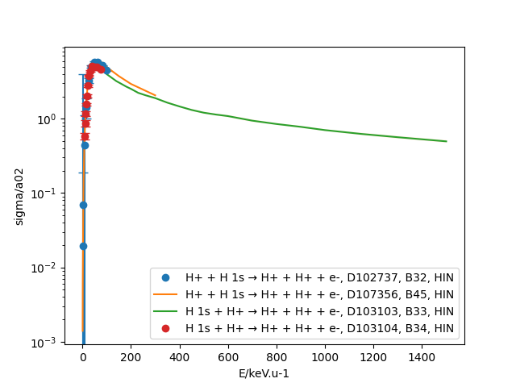

|PyPI version| |PyPI pyversions| |Code style|

.. |PyPI version| image:: https://img.shields.io/pypi/v/pycollisiondb.svg
   :target: https://pypi.python.org/pypi/pycollisondb
.. |PyPI pyversions| image:: https://img.shields.io/pypi/pyversions/pycollisiondb.svg
   :target: https://pypi.org/project/pycollisiondb/
.. |Code style| image:: https://img.shields.io/badge/code%20style-black-000000.svg
   :target: https://github.com/psf/black
.. _PYPI: https://pypi.org/project/pycollisiondb/
.. _COLLISIONDB: https://db-amdis.org/collisiondb/
.. _ALADDIN2: https://db-amdis.org/aladdin2/
.. _Documentation: https://db-amdis.org/collisiondb/submitting-data/

.. contents::

*****************************
Introduction to PyCollisionDB
*****************************

PyCollisionDB is a Python package for interacting with `CollisionDB`_ or `ALADDIN2`_, databases
of plasma collisional cross sections and rate coefficients.

Datasets in these collisional databases can be retrieved in a standardized way and compared, aggregated, and assessed using a set of predefined Python methods.

Installation
============

The ``PyCollisionDB`` package can be installed either from `PYPI`_ using pip

.. code-block:: bash

    python3 -m pip install pycollisiondb

or from the source by running (one of the two) from the project source directory.

.. code-block:: bash

    # either
    python setup.py install

    # or
    python3 -m pip install .

PyCollision
===========

The ``PyCollision`` object represents the main instance of the ``PyCollisionDB`` package for interacting with collisional databases, and datasets may be compared, output in various formats, and manipulated using the methods object as described below:

.. code-block:: pycon

    >>> from pycollisiondb.pycollisiondb import PyCollision

Dataset(s) Search 
------------------

Collisional datasets can be retrieved using ``PyCollision`` class method ``get_datasets`` for a given query. The value of each query can be passed as a Python dictionary with valid metadata keys, and values can be specified either as a string or a list of comma-separated strings.

.. code-block:: pycon

    >>> # Fetch datasets from the server over the API.
    >>> query = {'reactants': ['W+61', 'H']}
    >>> pycoll = PyCollision.get_datasets(query=query)
    
or datasets can be acessed from a locally-cached archive 

.. code-block:: pycon

    >>> # Specify the data directory for accessing the archive
    >>> DATA_DIR = '/Users/tmp/results'
    >>> # archive UUID
    >>> archive_uuid = '026a7abd-5ed7-4e30-827d-f3f606f3fa98'
    >>> pycoll = PyCollision.get_datasets(archive_uuid=archive_uuid, DATA_DIR=DATA_DIR)
 

Valid Query Keywords
********************

.. code-block:: pycon
 
    >>> pycoll.VALID_QUERY_KEYWORDS
    (ˈpkˈ,
     ˈpksˈ,
     ˈreaction_textˈ,
     ˈreaction_textsˈ,
     ˈreactant1ˈ,
     ˈreactant2ˈ,
     ˈproduct1ˈ,
     ˈproduct2ˈ,
     ˈprocess_typesˈ,
     ˈmethodˈ,
     ˈdata_typeˈ,
     ˈreactantsˈ,
     ˈproductsˈ,
     ˈdoiˈ)
    
    >>> # Example
    >>> pycoll = PyCollision.get_datasets(query={'rxns': ['H']})
    ---------------------------------------------------------------------------
    PyCollisionDBKeywordError                 Traceback (most recent call last)
    ...
    PyCollisionDBKeywordError: Invalid query keyword in dict_keys(['rxns'])
     
Please see the `documentation`_ for currently available choices or formats (if any) for query key values.

.. code-block:: pycon

    >>> # reaction_text is a string consisting of a single reaction,
    >>> # while a comma-separated list of reactions can be searched with the reaction_texts key.
    >>> # data_type can be specified as one of "cross section", "differential cross section" or "rate coefficient".
    >>> query = {'reaction_text': "H+ + H 1s -> H+ + H+ + e-",
                 'data_type': 'sigma'}
    >>> pycoll = PyCollision.get_datasets(query=query)
    ---------------------------------------------------------------------------
    PyCollisionDBConnectionError              Traceback (most recent call last)
    ...
    PyCollisionDBConnectionError: Could not retrieve data: HTTP 400 (Bad Request) returned from https://db-amdis.org/collisiondb/api/

Accessing data from the datasets
************************************

.. code-block:: pycon

   >>> # Proton-impact ionization of H.
   >>> query = {'reactants': ['H+', 'H 1s'],
                 'process_types': ['HIN'],
                 'data_type': 'cross section'}
   >>> pycoll = PyCollision.get_datasets(query=query)
   
   >>> # Datasets retrieved from the server as a dict keyed by pk ID.
   >>> pycoll.datasets
   {102737: D102737: H+ + H 1s → H+ + H+ + e-,
    107356: D107356: H+ + H 1s → H+ + H+ + e-,
    103103: D103103: H 1s + H+ → H+ + H+ + e-,
    103104: D103104: H 1s + H+ → H+ + H+ + e-} 
     
.. code-block:: pycon
 
    >>> # A list of datasets pks identified by each distinct reaction text.
    >>> pycoll.pks
    defaultdict(list,
            {'H+ + H 1s → H+ + H+ + e-': [102737, 107356],
             'H 1s + H+ → H+ + H+ + e-': [103103, 103104]}) 
    
    >>> # Summarize datasets for each distint reaction text.
    >>> pycoll.summarize_datasets()
    H+ + H 1s → H+ + H+ + e-
    ========================================================================
     qid: D102737
     process_types: ['HIN']
     data_type: cross section
     refs: {'B32': {'doi': '10.1016/j.adt.2019.05.002'}}
     qid: D107356
     process_types: ['HIN']
     data_type: cross section
     refs: {'B45': {'doi': '10.1140/epjd/e2019-100380-x'}} 
    
    H 1s + H+ → H+ + H+ + e-
    ========================================================================
     qid: D103103
     process_types: ['HIN']
     data_type: cross section
     refs: {'B33': {'doi': '10.1088/0022-3700/14/14/009'}}
     qid: D103104
     process_types: ['HIN']
     data_type: cross section
     refs: {'B34': {'doi': '10.1088/0022-3700/20/11/016'}}

.. code-block:: pycon

   >>> # Contents of the manifest.json file available in archive
   >>> pycoll.manifest 
    {'timestamp': '2022-12-08 16:00:32.768200+00:00',
     'uuid': '4d3bf0d4-c786-4712-b7a6-e5c04e67c89c',
     'GET_string': '',
     'ndatasets': 4,
     'datasets': {'D102737': 'H+ + H 1s → H+ + H+ + e-',
     'D107356': 'H+ + H 1s → H+ + H+ + e-',
     'D103103': 'H 1s + H+ → H+ + H+ + e-',
     'D103104': 'H 1s + H+ → H+ + H+ + e-'}}  
     
.. code-block:: pycon

   >>> # Resolve the references for all the datasets into proper, citeable format.
   >>> # this accesses the django-pyref API through the Server.
   >>> pycoll.REFS_API_URL 
   'https://db-amdis.org/collisiondb/refs/api/'
   
   >>> pycoll.resolve_refs()
   >>> # a dict with bibliographic data identified by pk ID
   >>> pycoll.refs
   {
   'B32': {'authors': 'H. Agueny, J. Petter Hansen, A. Dubois, A. Makhoute, A. Taoutioui, N. Sisourat',
    'title': 'Electron capture, ionization and excitation cross sections for keV collisions between fully stripped ions and atomic hydrogen in ground and excited states',
    'journal': 'Atomic Data and Nuclear Data Tables',
    'volume': '129-130',
    'page_start': '101281',
    'page_end': '',
    'article_number': '101281',
    'year': 2019,
    'note': '',
    'doi': '10.1016/j.adt.2019.05.002',
    'bibcode': '2019ADNDT.12901281A',
    'url': 'https://dx.doi.org/10.1016/j.adt.2019.05.002'},
   'B33': {...},
   'B34': {...},
   'B45': {...}
   }
  
       
More details
**************

.. code-block:: pycon

    >>> # List of all datasets pks 
    >>> pycoll.all_pks
    [102737, 107356, 103103, 103104]
    
    >>> # Access to individual dataset via pk
    >>> pycoll.datasets[102737].metadata
    {'qid': 'D102737',
     'reaction': 'H+ + H 1s → H+ + H+ + e-',
     'process_types': {'HIN': 'Ionization'},
     'data_type': 'cross section',
     'refs': {'B32': {'doi': '10.1016/j.adt.2019.05.002'}},
     'json_comment': {'comment': 'Ionization cross sections in H+ + H collisions using a semiclassical close-coupling approach. Cross sections represent the average values of the results obtained with two basis sets and the uncertainties provide the estimate of convergence of the cross sections'},
     'json_data': {'method': 'CC',
     'columns': [{'name': 'E', 'units': 'eV.u-1'},
     {'name': 'sigma', 'units': 'cm2'}]}}
    
.. code-block:: pycon

    >>> # Prints the numerical values of datasets along with units.
    >>> pycoll.datasets[102737].print_values()
    E / eV.u-1 sigma / cm2
    1000.0 5.471e-19
    4000.0 1.96e-18
    9000.0 1.235e-17
    16000.0 4.05e-17
    25000.0 9.192e-17
    36000.0 1.405e-16
    49000.0 1.628e-16
    64000.0 1.605e-16
    81000.0 1.45e-16
    100000.0 1.248e-16
    
    
.. code-block:: pycon

    >>> # Metadata for all datasets can be accessed with a for loop.
    >>> for ds in pycoll.datasets.values():
    >>>     print(ds.metadata)
 

Convert Units
---------------
The ``PyCollision`` method ``convert_units`` can be used to change the units of datasets.

.. code-block:: pycon

    >>> pycoll.datasets[102737].x
    array([  1000.,   4000.,   9000.,  16000.,  25000.,  36000.,  49000.,
         64000.,  81000., 100000.])
    >>> # The units of all datasets are changed,
    >>> # Energy is changed from eV.u-1 (default) to keV.u-1 and sigma from cm2 (default) to a02 (atomic units).
    >>> # This accesses the pyqn library.
     >>> pycoll.convert_units({'E': 'keV.u-1', 'sigma': 'a02'})
     >>> pycoll.datasets[102737].x
     array([  1.,   4.,   9.,  16.,  25.,  36.,  49.,  64.,  81., 100.])
     
.. code-block:: pycon

    >>> # Change the units of a single dataset,
    >>> # provide the column name followed by units as arguments.
    >>> pycoll.datasets[102737].convert_units('sigma', 'm2')
  
Visualization tools
------------------------------
The ``PyCollision`` method ``plot_all_datasets`` can be used to create plots using the ``pyplot`` submodule of the ``Matplotlib`` library as the visualization utility.

.. code-block:: pycon  

    >>> import matplotlib.pyplot as plt
    >>> %matplotlib notebook
    >>> # Make a plot, indicating how the data should be labelled.
    >>> fig, ax = plt.subplots()
    >>> # The default legend consists of qid/pk and reaction labels,
    >>> # it can be customized to include refs and process_types or either of these lables.
    >>> pycoll.plot_all_datasets(ax, label=('reaction', 'qid', 'refs', 'process_types'))
    >>> plt.legend()
    

   
Connection to the ALADDIN2 API
------------------------------

.. code-block:: pycon

    >>> #By default, PyCollisionDB interacts with the API to the CollisionDB server
    >>> pycoll.API_URL
    'https://db-amdis.org/collisiondb/api/'

    >>> #API_URL can be directed to ALADDIN2 server by passing argument DB_URL 
    >>> DB_URL = 'https://db-amdis.org/aladdin2'
    >>> pycoll = PyCollision.get_datasets(query=query,DB_URL=DB_URL)
    >>> pycoll.API_URL
    'https://db-amdis.org/aladdin2/api/'
    

